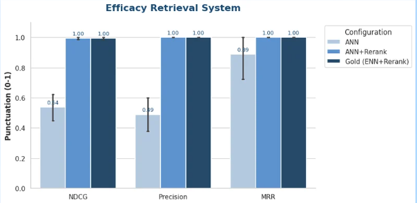

# Still_thinking — README Guide

## Overview

**Still_thinking** is an academic research assistant built with Retrieval-Augmented Generation (RAG). Given a research idea or question, it retrieves semantically similar arXiv papers, re-ranks them, and uses an LLM to compare the idea against existing literature; highlighting novelty, differences, and related directions.



---

## Architecture

```
User Query
    │
    ▼
Angular Frontend (port 4200)
    │  HTTP
    ▼
FastAPI Backend (port 8000)
    ├── Language detection (langid)
    ├── Guardrails (reject low-similarity queries)
    ├── Vector Search (ChromaDB / SPECTER)
    │     ├── ANN via HNSW (fast)
    │     └── ENN via brute-force (exact)
    ├── Re-ranking (CrossEncoder ms-marco-MiniLM-L-6-v2)
    └── LLM generation (Qwen3:8b / Qwen3:32b via Ollama)
```

**Corpus:** 103,260 arXiv abstracts indexed with `all-MiniLM-L6-v2` (384-dim embeddings) in ChromaDB.

---

## Repository Structure

```
Still_thinking/
├── backend-fastapi/          # Python FastAPI backend (RAG core)
│   ├── main.py               # Server: /search, /summarize endpoints
│   ├── llm/
│   │   ├── client.py         # Ollama client wrappers (Qwen3:8b / 32b)
│   │   ├── prompts.py        # Prompt template loader
│   │   ├── language.py       # Language detection + multilingual support
│   │   └── guardrails.py     # Low-confidence query rejection
│   ├── scripts/
│   │   ├── build_chroma.py   # One-time DB indexing pipeline
│   │   ├── search_chroma.py  # ANN + ENN retrieval logic
│   │   └── benchmark.py      # Performance benchmarking
│   ├── prompts/              # Prompt template .txt files
│   ├── chroma_db/            # Persistent ChromaDB vector store
│   └── specter/              # Alternate SPECTER-based search backend
├── src/                      # Angular 21 frontend
│   └── app/
│       ├── components/chat/  # Chat interface
│       ├── components/landing/
│       └── services/         # HTTP + theme services
├── evaluation/               # Evaluation suite — see evaluation/README.md
│   ├── main_eval.py          # Compares ANN / ANN+rerank / ENN+rerank
│   ├── evaluation_utils.py   # NDCG, Precision@K, MRR
│   ├── advanced_eval.py      # Guardrail, token efficiency, latency
│   ├── generate_gold.py      # Gold standard generation
│   ├── llm_as_a_judge/       # RAGAS LLM-judged answer quality + results
│   └── EVALUATION_REPORT.md  # Full write-up of retrieval + generation evaluation
├── notes/                    # Week-by-week dev notes & prompt-engineering iterations
├── requirements.txt          # Python dependencies (standalone scripts)
├── package.json              # Node/Angular dependencies
├── LICENSE                   # MIT
└── .env                      # Ollama credentials (not committed)
```

---

## Prerequisites

| Tool | Version |
|------|---------|
| Python | 3.10+ |
| Node.js | 18+ |
| Angular CLI | 21 |
| Access to UC3M Ollama gateway | (or local Ollama instance) |

---

## Setup

### 1. Clone & configure environment

```bash
git clone <repo-url>
cd Still_thinking
```

Create a `.env` file in the root (and/or `backend-fastapi/`) with:

```env
OLLAMA_API_KEY=<your-key>
OLLAMA_URL=https://yiyuan.tsc.uc3m.es
OLLAMA_MODEL=qwen3:8b
```

### 2. Install Python dependencies

```bash
pip install -r requirements.txt
```

### 3. Build the ChromaDB vector store (first run only)

```bash
cd backend-fastapi
python scripts/build_chroma.py
```

This indexes `papers_filtered.jsonl` (~103k abstracts) into `chroma_db/`. It is a one-time operation.

### 4. Start the FastAPI backend

```bash
cd backend-fastapi
uvicorn main:app --reload --port 8000
```

### 5. Install frontend dependencies and start dev server

```bash
npm install
npx ng serve
```

Open `http://localhost:4200` in your browser.

---

## API Endpoints

| Method | Path | Description |
|--------|------|-------------|
| `POST` | `/search` | Retrieve + re-rank papers, then generate LLM comparison |
| `POST` | `/summarize` | Summarize a single paper by abstract |
| `POST` | `/summarize-detailed` | Generate a detailed structured summary |

**Example `/search` request:**

```json
{
  "query": "Using transformers for protein structure prediction",
  "top_k": 5,
  "use_reranker": true,
  "use_enn": false
}
```

---

## Retrieval Modes

| Mode | Description | Speed |
|------|-------------|-------|
| **ANN** | HNSW approximate nearest-neighbor search | Fast |
| **ANN + Reranking** | ANN followed by CrossEncoder re-ranking | Medium |
| **ENN + Reranking** | Exact brute-force search + CrossEncoder | Slow but most accurate |

The production default is **ANN + Reranking**. ENN is used for gold-standard evaluation only.

---

## Multilingual Support

Queries in Spanish, French, Italian, and German are automatically detected and translated to English for retrieval; the LLM response is then generated in the user's original language.

---

## Evaluation

The [evaluation/](evaluation/) folder contains a full evaluation suite — see
[evaluation/README.md](evaluation/README.md) for what each script measures and how to run it,
and [evaluation/EVALUATION_REPORT.md](evaluation/EVALUATION_REPORT.md) for the full write-up.

```bash
cd evaluation

# Run main retrieval comparison (ANN vs ANN+rerank vs ENN+rerank)
python main_eval.py

# Run advanced tests (guardrails, token efficiency, latency)
python advanced_eval.py

# Generate gold standard (requires Qwen3:32b access)
python generate_gold.py
```

**Metrics computed:** NDCG@K, Precision@K, MRR, guardrail accuracy, token efficiency, latency,
plus RAGAS-based faithfulness/answer-relevancy/context precision & recall under
`evaluation/llm_as_a_judge/`.

Results are saved under [evaluation/llm_as_a_judge/results/](evaluation/llm_as_a_judge/results/).

---

## Frontend

Built with **Angular 21** + **Tailwind CSS**. Key features:
- Chat-style interface for iterative research queries
- Per-paper on-demand summaries
- PDF export of results
- Graph visualization of paper relationships (vis-network)

```bash
npx ng build        # Production build → dist/
npx ng test         # Unit tests (Vitest)
```

---

## Models Used

| Role | Model | Notes |
|------|-------|-------|
| Embeddings | `all-MiniLM-L6-v2` | 384-dim, sentence-transformers |
| Re-ranking | `cross-encoder/ms-marco-MiniLM-L-6-v2` | Pointwise relevance scoring |
| LLM (fast) | `qwen3:8b` | Default generation model |
| LLM (strong) | `qwen3:32b` | Used for gold standard + judge |
| Alt. embeddings | SPECTER | 768-dim, separate backend in `specter/` |

---

## Notes & Reports

Development notes and week-by-week findings are in [notes/](notes/):
- [evaluation_report.md](notes/evaluation_report.md) — Early-stage evaluation notes
- [week1_prompt_tests.md](notes/week1_prompt_tests.md) — Prompt engineering iterations
- [week2_prompt_texts.md](notes/week2_prompt_texts.md) — Further prompt engineering iterations

The final, comprehensive evaluation report is [evaluation/EVALUATION_REPORT.md](evaluation/EVALUATION_REPORT.md).

---

## License

[MIT](LICENSE)
